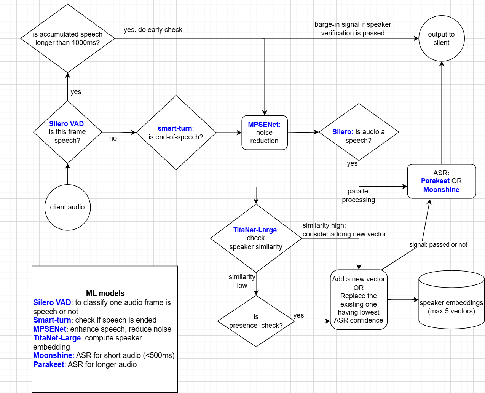

# STT Gateway Documentation

## Introduction

The STT Gateway is a real-time speech-to-text service that processes streaming audio from clients over WebSocket connections and returns transcriptions. The system is designed for conversational AI applications where accurate speaker identification, low latency, and robust noise handling are critical. It combines multiple machine learning models to achieve high-quality transcription while filtering out background noise and non-primary speakers.

The gateway operates as the central orchestrator, receiving raw audio streams from clients, processing them through a sophisticated pipeline, and returning transcribed text. It integrates with several external services including an ASR worker for transcription, a speaker verification worker for identity confirmation, and optionally a smart-turn service for intelligent end-of-speech detection.

## Audio Input and Frame Processing

The gateway accepts audio in two formats. The default format is PCM 16-bit audio at 16kHz sample rate, which requires no conversion. Alternatively, clients can send μ-law encoded audio at 8kHz, which the gateway automatically converts to PCM 16kHz using GPU-accelerated resampling.

All audio processing occurs on a frame-by-frame basis. Each frame represents 32 milliseconds of audio, containing 512 samples (1024 bytes for 16-bit audio). This frame size is chosen to balance between responsiveness and computational efficiency. The gateway maintains an audio buffer that accumulates incoming bytes until a complete frame is available for processing.

## Voice Activity Detection

- **Voice Activity Detection (VAD)** - Silero VAD for frame-level speech classification
- **Smart Turn Detection** - ML-based end-of-speech detection
- **Noise Reduction** - GPU-accelerated audio enhancement (MPSENet or GTCRN)
- **Audio Quality Assessment** - DNSMOSPro-based quality filtering
- **Speaker Verification** - TitaNet-Large for speaker embedding and verification
- **ASR** - Dual-model transcription (Moonshine for short audio, Parakeet for longer)

When the VAD detects the first speech frame, the system transitions into a "speaking" state and begins accumulating audio into a speech buffer. To avoid cutting off the beginning of utterances, the system maintains a small buffer of recent non-speech frames (typically 3 frames, or about 96ms) that get prepended to the speech buffer when speech is detected.

During the speaking state, the system counts consecutive speech frames and silent frames. Speech frames increment the speech counter and reset the silent counter, while non-speech frames increment the silent counter. This counting mechanism drives the end-of-speech detection logic.

Determining when a speaker has finished talking is one of the most challenging aspects of real-time speech processing. The gateway supports two methods for end-of-speech detection.

The naive method simply waits for a configurable duration of silence (default 500ms) before declaring the end of speech. This approach is straightforward but can feel unresponsive in fast-paced conversations or may cut off speakers who pause to think.

The smart-turn method uses a machine learning model to predict whether the current speech represents a complete conversational turn. After the minimum silence threshold is met, the system sends the accumulated audio to the smart-turn service, which returns a probability that the speaker has finished. If this probability exceeds the configured threshold (default 0.5), the speech is finalized. This approach better handles natural speech patterns including mid-sentence pauses.

The system also enforces maximum speech duration (default 20 seconds) to prevent runaway segments, and minimum speech duration (default 120ms) to filter out very brief sounds that are unlikely to be meaningful speech.

## Noise Reduction

Before transcription, audio undergoes noise reduction to improve ASR accuracy. The gateway supports two noise reduction models: GTCRN and MPSENet. Both run on GPU for efficient processing.

GTCRN is a lightweight model that provides fast processing with good noise reduction quality. It uses STFT-based processing and is loaded from a local checkpoint file. MPSENet is a more sophisticated model loaded from HuggingFace that typically provides higher quality enhancement at the cost of slightly more computation.

To minimize latency for longer utterances, the gateway implements incremental noise reduction. Every approximately 2 seconds of accumulated speech (62 frames), the system kicks off an asynchronous noise reduction task for that chunk. When speech finally ends, the system only needs to enhance the remaining portion and combine it with the already-processed chunks.

The noise reduction models are managed through a GPU model pool that maintains multiple replicas with separate CUDA streams. This enables true parallel processing across multiple concurrent clients, preventing one client's audio from blocking another's processing.

## Audio Quality Assessment

For short audio segments (under 600ms), the system performs an additional quality check using DNSMOSPro to determine if the audio actually contains speech. This helps filter out brief noise bursts, clicks, or other non-speech sounds that might otherwise be sent to ASR. If the quality check determines the audio is not speech, it is silently discarded without being transcribed.

## Transcription

Audio that passes all preprocessing stages is sent to the ASR worker service for transcription. The ASR system uses a dual-model approach optimized for different audio lengths. Moonshine handles short utterances under 500ms, while Parakeet handles longer segments. This specialization improves accuracy across different utterance types.

The transcription results include word-level confidence scores. The gateway applies confidence filtering to reject low-quality transcriptions. Single words must meet a higher confidence threshold than multi-word phrases. Common filler words and backchannels like "mm-hmm", "uh-huh", and "um" are blacklisted and filtered out regardless of confidence. A small whitelist of short words including "hi", "hey", "hello", and "bye" are allowed through with slightly relaxed thresholds since these are legitimate short responses.

When confidence is too low, rather than discarding the audio entirely, the system returns a placeholder message indicating unintelligible audio. This allows downstream systems to handle the situation appropriately, perhaps by asking the user to repeat themselves.

## Speaker Verification

The speaker verification system helps identify the primary caller and filter out background speakers, TV audio, or other voices that might be captured by the microphone. This feature is optional and can be disabled via configuration.

The system operates in two phases. During the enrollment phase, the first several utterances from a session are used to build a speaker profile. Each utterance goes through an LLM check using Gemini to determine if the transcript appears to be from the primary user based on conversation context. If the LLM approves, the audio's speaker embedding (computed by TitaNet-Large) is added to the profile. Once sufficient embeddings are collected, enrollment is complete.

After enrollment, the system enters the verification phase. Each new utterance is verified against the stored speaker profile. The verification service returns a similarity score and a decision: the speaker is confirmed, uncertain but likely (uncertain_high), or rejected. Confirmed and uncertain_high utterances are sent to the client, while rejected utterances are blocked.

The system maintains up to 5 speaker embedding vectors per session. When the profile is full but a new high-confidence utterance is verified, the system may replace the embedding with the lowest ASR confidence score. This allows the profile to adapt over time while maintaining quality.

A special case handles "presence check" phrases like "are you there?" or "can you hear me?". These phrases are detected using fuzzy string matching, and when identified from a failed or uncertain verification, the system forces through the transcription and updates the speaker embedding. This prevents the frustrating situation where a user's attempts to get the system's attention are blocked.

## Early Verification and Hold-On Signaling

For enrolled users, when speech accumulates to 1 second, the system performs early verification without waiting for the utterance to complete. If the early verification passes or returns uncertain_high, the system starts a hold-on loop that sends periodic signals to the client indicating that speech is being processed. These hold-on messages are sent every 160ms and help the client provide appropriate user feedback during processing.

This early verification serves two purposes. First, it provides faster feedback to the client that valid speech is being received. Second, it allows the system to start preparing for transcription earlier, reducing perceived latency.

## Conversation State and Adaptive Endpointing

The gateway maintains conversation state throughout a session, tracking both user and agent utterances. This history is used by the LLM when making enrollment decisions and helps provide context for speaker verification.

The conversation state also tracks speaker disfluency patterns by counting filler words like "um", "uh", "hmm", and similar hesitation markers. Speakers with high disfluency ratios (over 20%) tend to pause more while formulating their thoughts, so the system automatically extends the endpointing thresholds by 20-30% to avoid cutting them off prematurely. Speakers with normal disfluency patterns use the base thresholds. This adaptation happens automatically based on the accumulated speech patterns within a session.

## WebSocket Communication

Clients connect to the gateway via WebSocket at the `/ws/stt` endpoint. The connection supports an optional `encoding` query parameter to specify the input audio format, defaulting to `pcm_16k`. A `session_id` header can be provided to identify the session, or one will be auto-generated.

Clients can send audio in two ways. JSON messages contain base64-encoded audio in an `audio` field, with an optional `last_utterance` field containing the agent's most recent response for context. Alternatively, clients can send raw binary audio bytes directly.

The gateway sends JSON responses to clients. Final transcriptions include the `is_final` flag set to true, the transcribed text, an average confidence score, and the audio duration in milliseconds. During processing, hold-on messages are sent with `is_final` set to false and a placeholder transcript.

## Session Lifecycle

When a WebSocket connection is established, the gateway creates an AudioProcessor instance for that session. This processor maintains all session-specific state including the VAD model state, speech buffers, speaker enrollment status, and conversation history.

A background sender loop continuously checks for completed audio segments and processes them through the full pipeline. This decouples audio reception from processing, allowing the system to handle bursty network traffic smoothly.

When the connection closes, the gateway finalizes any pending speech, cleans up the speaker profile from the verification service, and optionally saves debug audio if configured. The finalization ensures that utterances in progress at disconnect time are still processed and returned to the client if possible.

## Configuration

The gateway is highly configurable through environment variables. Key settings include the VAD speech threshold for tuning sensitivity, minimum and maximum endpointing durations for controlling response timing, ASR confidence thresholds for filtering quality, and speaker verification enablement.

Audio processing can be tuned by selecting the noise reduction model (GTCRN or MPSENet), adjusting the number of GPU worker replicas for parallel processing, and enabling or disabling various preprocessing stages. Debug audio saving can be enabled to capture all session audio for troubleshooting.

The external service URLs for ASR, speaker verification, and smart-turn detection are all configurable, allowing flexible deployment topologies where services may run on different hosts or ports.

## Summary

The STT Gateway implements a comprehensive real-time speech-to-text pipeline that goes far beyond simple transcription. By combining voice activity detection, intelligent end-of-speech detection, GPU-accelerated noise reduction, speaker verification, and confidence-based filtering, it delivers high-quality transcriptions suitable for conversational AI applications. The system adapts to individual speakers, handles noisy environments, identifies the primary caller, and provides responsive feedback throughout the processing pipeline.
